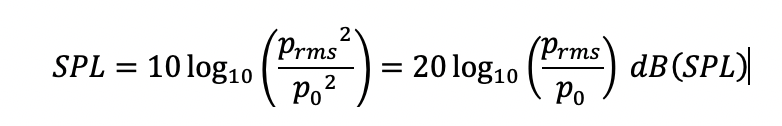
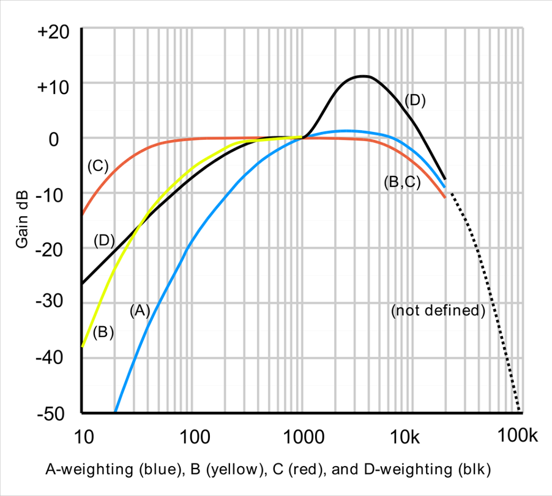

# Team Scheire Tatjana - Tinnitus

Aflevering op VRTNu: [https://www.vrt.be/vrtnu/a-z/team-scheire/2/team-scheire-s2a2/
]()

Uitleg over de oplossing in deze podcast: [https://soundcloud.com/nerdlandmakertalk/09-maarten-weyn]()

# Geluidsmetingen

## 1. Wat is geluid?

**Geluid** is de **hoorbare verandering** van **luchtdruk** , of als je helemaal volledig wil zijn de verandering van de **dichtheid** van een **elastisch medium** , dat kan een **gas** zijn, een **vloeistof** of een **vaste** stof. En een geluidsbron veroorzaak verandering in de luchtdruk die zich in een golfbeweging door de lucht voortbewegen. Een luidspreker bijvoorbeeld zet een elektrisch signaal om in een beweging van een membraan. Die beweging zal dan een verandering in de luchtdruk veroorzaken.

Geluidsgolven tussen 20 Hz en 20 kHz, m.a.w. golven die 20 tot 20 000 keer per seconde bewegen kunnen door de mensen worden waargenomen. Boven 20 kHz hebben we wat we ultrasoon noemen.

Wist je dat geluid zich in lucht (bij 20°C en op zeeniveau) met ongeveer 343 m/s (of 1230 km/u) voortbeweegt, en in water van 20°C zelfs met 1482 m/s.

## 2. Wat is dan de geluidssterkte?

De **geluidsdruk** is het lokale drukverschil t.o.v. de atmosferische luchtdruk ten gevolge van een geluidsgolf. En dat wordt typisch in Pascal uitgedrukt.

Dit verschil wordt over een zeer kleine periode uitgemiddeld, men berekent de &quot;root mean square&quot; of de wortel van het gemiddelde van het kwadraat. Deze variatie is typisch zeer klein, de laagste waarde die nog hoorbaar is, is rond 2 \* 10-5 of 0.00002 Pa terwijl een explosie ongeveer 104 of 10000 kan zijn.

Daarom gebruik met een logaritmes waarde om de geluidsruk uit te drukken en dat noemen het **geluidsniveau** of Sound Pressure Level (SPL) in dB:

Met p0 de referentieruk 2 x 10-5 Pa of 20 uPa, de gehoordrempel van een gemiddeld persoon bij een frequentie van 1000 Hz.

Dus deze waarde geeft een indicatie hoeveel keer het geluid luider is dan gehoordrempel.

## 3. Wat is een logaritme?

In het geval van een geluidsniveau wordt een logaritme gebruikt met grondtal 10. In dat geval is de logaritme van een getal het getal waartoe 10 moet worden verheven. de logaritme van 1000 is bijvoorbeeld 3 want 103 = 10 x 10 x 10 = 1000.

In het geval van het geluidsniveau berekenen we de logaritme van het aantal keer het geluid sterkers is dan de gehoordrempel, en dat getal nog eens x 20.

## 4. Hoe kunnen we dat nu meten

We gaan dit meten met een MEMS microfoon. MEMS staat voor _microelectron-mechanical systems_ of hele kleine elektro-mechanische systemen. In een MEMS microfoon zit een zeer klein beweegbaar membraan, een klein gaatje (of meerdere) laten het toe dat de luchtdruk kan veranderen die door de geluidgolven worden veroorzaakt en een vaste structuur.

Diagram van een dwarssnede van een MEMS-microfoon (figuur van EDN)

MP34DT05TR microfoon

Door de geluidgolven zal het membraan gaan bewegen en het verschil in capaciteit tussen het membraan en de vaste structuur wordt omgezet naar een elektrisch signaal.

In de chip van de MEMS-microfoon kan dit verschil in een spanning rechtstreeks worden doorgegeven naar een microcontroller (in analoge MEMS-microfoons) of in een digitale kan ze omgezet worden aar een PDM signaal.

Een PDM staat voor pulse density modulation. Bij PDM wordt een analoog signaal omgezet naar een binair signaal. In plaats van het signaal om te zetten naar codewoorden, komt bij PDM de relatieve dichtheid van de pulsen overeen met de amplitude van het analoge signaal.

0101101111111111111101101010010000000000000100010011011101111111111111011010100100000000000000100101

Vertegenwoordigd bvb

Figuur van Wikipedia (Kaldosh)

Het geluid wordt in dit geval 16000 keer per seconden gemeten. De microfoon is gekalibreerd en meet een waarde 1642 bij 94 dbA. Daarnaast meten we ook een root mean square gemiddelde in plaats van een dbFS (full scale meting) en we moeten dit nog corrigeren.

double leq = 3.0103+ 94 + 20 \* log10(sqrt(sumsquare / total\_samples) / 1642);

Nu voor we de samples gebruiken wordt de gemeten waarde nog gewogen naar de frequenties waarvoor het menselijk oor gevoeliger is. Zo worden bvb tonen onder de 1000 verzwakt. Een toon van 10 Hz wordt 70 keer zwakker gehoord dan een toon van 1000 Hz. Hoeveel dit niet helemaal correct is gebruiken we wel de dB(A) omdat de normen en wetgeving ook gebruik maakt van deze gewogen waarden.

Figuur van Lindosland at English Wikipedia

Nu kunnen we bijvoorbeeld per seconden meten wat het geluidsniveau is. Maar eigenlijk zijn we niet op zoek naar het geluidsniveau zelf, maar wel naar de geluidsdosis.

## 5. Wat is de geluidsdosis?

Een **geluidsdosis** is het gemiddelde geluidsniveau over een bepaalde (langere periode), bijvoorbeeld 8 uur of 24 uur. De WHO (wereld gezondheidsorganisatie) zegt dat deze normen voor 8u 80 dbA zijn en voor 24u 75 dbA.

Qua energieverbruik en dataopslag kunnen we uiteraard niet 8 u geluid gaan opnemen maar nemen we elke 10 seconden een sample van 1 seconde. Daarop bereken we het geluidsniveau. Daarna middelen we dit uit over 8u en 24u.

Je mag niet de gemiddeld van de dBA waarden nemen, dit zijn immers gemiddelde. Maar zetten de waardes eerst terug om naar de geluidsdruk en berekenen dan hoeveel % we reeds hebben ten opzichte van de herberekende waarde. Zo krijgen we 2 percentages die ook intuïtiever kunnen gebruikt worden door de gebruiker van het systeem.

# Wat staat er in de repo

* In **tizen** staat de oorspronkelijk ontwikkeling voor de Samsung Watch.
* In **hardware** het schema en PCB van de ontwikkelde wearble mee ontwikkeld door Kwinten Schram.
* In **3DModel** de stl van de gebruikte behuizing
* In **Arduino** een aantal test applicaties
* In **cordova** de cordova applicatie voor iOS
* In **Firmware** de code voor de wearable
